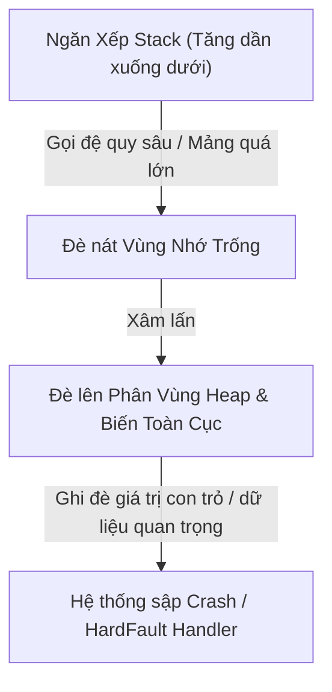

# Bài 01: Bản Đồ Phân Vùng Bộ Nhớ Trong Lập Trình C Nhúng

> **Chuyên mục**: Level 0 - Nền tảng Toán & CS  
> **Thời lượng ước tính**: 45 phút  
> **Tài liệu tham chiếu**: [`tech.md`](../tech.md) & [`process.md`](../process.md)

---

## 1. MỤC TIÊU BÀI HỌC (LEARNING OBJECTIVES)
- [ ] Phân biệt rõ ràng 5 phân vùng bộ nhớ: **Text**, **Data (.data)**, **BSS (.bss)**, **Heap**, và **Stack**.
- [ ] Hiểu vị trí vật lý của từng phân vùng (Flash ROM vs SRAM) khi nạp chương trình vào vi điều khiển.
- [ ] Nhận diện và ngăn ngừa lỗi **Stack Overflow** (Tràn ngăn xếp) - một trong những nguyên nhân hàng đầu gây sập vi điều khiển (HardFault Crash).

---

## 2. BẢN CHẤT LÝ THUYẾT & NGUYÊN LÝ HOẠT ĐỘNG

Trên máy tính cá nhân (PC), hệ điều hành quản lý bộ nhớ ảo (Virtual Memory) thông qua khối quản lý bộ nhớ MMU (Memory Management Unit). Tuy nhiên, trên hầu hết các vi điều khiển nhúng 32-bit (như STM32 Cortex-M0/M3/M4/M7, ESP32) hoặc 8-bit (AVR, PIC), **CPU truy cập trực tiếp vào không gian địa chỉ vật lý (Physical Address Space)** mà không có bộ nhớ ảo.

### Sơ đồ phân vùng bộ nhớ SRAM và FLASH:

```
ĐỊA CHỈ CAO (0x2001FFFF - Đỉnh SRAM STM32F401 96KB)
┌──────────────────────────────────────────────┐
│                  STACK                       │ ◄── Tăng trưởng đi XUỐNG (Grow Downwards)
│ (Biến cục bộ, Địa chỉ trả về hàm, Ngữ cảnh)  │     Con trỏ SP (Stack Pointer)
├──────────────────────────────────────────────┤
│                      ▼                       │
│              [ VÙNG NHỚ TRỐNG ]              │
│                      ▲                       │
├──────────────────────────────────────────────┤
│                   HEAP                       │ ◄── Tăng trưởng đi LÊN (Grow Upwards)
│ (Bộ nhớ cấp phát động: malloc, calloc)       │
├──────────────────────────────────────────────┤
│                   .BSS                       │ ◄── Biến toàn cục / static CHƯA khởi tạo
│ (Khởi tạo về 0 bởi Startup Code)             │     hoặc khởi tạo = 0
├──────────────────────────────────────────────┤
│                  .DATA                       │ ◄── Biến toàn cục / static ĐÃ khởi tạo
│ (Giá trị khởi tạo lưu Flash, copy sang RAM)  │     giá trị khác 0 (vd: int count = 100;)
└──────────────────────────────────────────────┘
ĐỊA CHỈ THẤP (0x20000000 - Đáy SRAM)

┌──────────────────────────────────────────────┐
│                  .TEXT                       │ ◄── Nằm trong bộ nhớ FLASH (0x08000000)
│ (Mã máy biên dịch, Bảng ngắt Vector Table)   │     Chỉ đọc (Read-Only)
├──────────────────────────────────────────────┤
│                 .RODATA                      │ ◄── Hằng số const, chuỗi ký tự cố định
└──────────────────────────────────────────────┘
```

---

## 3. PHÂN TÍCH TỪNG PHÂN VÙNG BỘ NHỚ

### 3.1. Phân vùng `.text` (Code Segment)
- **Vị trí**: Bộ nhớ không khả biến **Flash ROM** (địa chỉ bắt đầu thường là `0x08000000` trên dòng STM32).
- **Thuộc tính**: Chỉ đọc (Read-Only) và có thể thực thi (Executable).
- **Nội dung**: Chứa mã máy nhị phân sau khi compiler dịch code C/C++, bảng véc-tơ ngắt (Vector Table), và các hàm toán học. Dữ liệu ở đây không bị mất khi mất điện.

### 3.2. Phân vùng `.rodata` (Read-Only Data)
- **Vị trí**: Flash ROM.
- **Nội dung**: Các hằng số được khai báo với từ khóa `const`, chuỗi ký tự cố định như `"Starting System...\n"`. Việc đưa dữ liệu sang Flash giúp tiết kiệm từng byte RAM quý giá của vi điều khiển.

### 3.3. Phân vùng `.data` (Initialized Data)
- **Vị trí**: Nằm trong **SRAM**, nhưng giá trị khởi tạo ban đầu được lưu trong **Flash ROM**.
- **Nội dung**: Chứa các biến toàn cục (global) hoặc biến tĩnh (static) có gán giá trị khác 0 ban đầu.
- **Cơ chế Bootloader**: Khi vi điều khiển vừa được cấp nguồn, hàm `Reset_Handler` trong file startup sẽ copy toàn bộ mảng dữ liệu khởi tạo từ Flash sang địa chỉ RAM tương ứng của phân vùng `.data`.

### 3.4. Phân vùng `.bss` (Block Started by Symbol - Uninitialized Data)
- **Vị trí**: Nằm trong **SRAM**.
- **Nội dung**: Chứa các biến toàn cục hoặc static **chưa được gán giá trị** hoặc gán bằng 0.
- **Cơ chế Bootloader**: Để tiết kiệm dung lượng Flash ROM, trình biên dịch không lưu hàng nghìn số 0 vào Flash. Thay vào đó, startup code chỉ lưu địa chỉ bắt đầu và độ dài của vùng `.bss`, rồi dùng một vòng lặp nạp số 0 vào toàn bộ vùng nhớ này lúc khởi động (Zero-filling).

### 3.5. Phân vùng Heap
- **Vị trí**: Nằm trong **SRAM**, tăng trưởng từ địa chỉ thấp lên địa chỉ cao.
- **Nội dung**: Bộ nhớ phục vụ việc cấp phát động thông qua các hàm `malloc()`, `calloc()`, `realloc()`.
- **Cảnh báo công nghiệp**: Trong các hệ thống nhúng thời gian thực (Hard Real-time) đạt chuẩn an toàn chức năng (ISO 26262 cho ô tô, MISRA C, DO-178C cho hàng không), **`malloc()` bị cấm hoàn toàn** vì nguy cơ phân mảnh bộ nhớ và thời gian thực thi bất định.

### 3.6. Phân vùng Stack
- **Vị trí**: Nằm ở đỉnh **SRAM** và tăng trưởng đi xuống địa chỉ thấp.
- **Nội dung**: Lưu trữ các biến cục bộ trong hàm, tham số truyền vào hàm, địa chỉ trả về (Return Address) khi hàm kết thúc, và lưu ngữ cảnh thanh ghi CPU khi có ngắt phần cứng (Interrupt context).
- **Cơ chế**: Vận hành theo nguyên tắc Vào-Sau-Ra-Trước (LIFO - Last In First Out), được quản lý tự động bởi thanh ghi con trỏ ngăn xếp **SP (Stack Pointer)** của CPU.

---

## 4. MÃ NGUỒN MINH HỌA VỊ TRÍ BIẾN TRONG BỘ NHỚ

```c
#include <stdint.h>
#include <stdlib.h>

/* 1. Hằng số: Nằm tại .rodata trong Flash */
const uint32_t FIRMWARE_ID = 0xAA550001;

/* 2. Biến toàn cục có khởi tạo khác 0: Nằm tại .data (RAM, nạp từ Flash) */
uint32_t g_system_baudrate = 115200;

/* 3. Biến toàn cục chưa khởi tạo: Nằm tại .bss (RAM, xóa về 0 lúc boot) */
uint32_t g_encoder_ticks;

/* 4. Biến toàn cục static = 0: Nằm tại .bss */
static uint8_t s_motor_state = 0;

void Calculate_Trajectory(float target_x, float target_y) {
    /* 5. Biến cục bộ: Nằm tại STACK */
    float delta_x = target_x - 10.0f;
    float delta_y = target_y - 10.0f;
    uint8_t temp_buffer[32]; // 32 bytes cấp phát tức thời trên Stack
    
    /* 6. Biến static cục bộ có khởi tạo: Nằm tại .data */
    static uint16_t execution_count = 1;
    execution_count++;

    /* 7. Con trỏ heap_ptr nằm ở STACK, nhưng 64 bytes trỏ tới nằm ở HEAP */
    uint8_t *heap_ptr = (uint8_t *)malloc(64);
    if (heap_ptr != NULL) {
        // Thao tác với heap...
        free(heap_ptr); // Bắt buộc giải phóng tránh Memory Leak
    }
} // Thoát hàm: Toàn bộ biến cục bộ trên STACK tự động bị thu hồi!
```

---

## 5. THẢM HỌA THỰC TẾ: STACK OVERFLOW (TRÀN NGĂN XẾP)



### Nguyên Nhân Gây Tràn Stack:
1. **Khai báo mảng cục bộ quá lớn trong hàm**:
   ```c
   void Read_Camera_Frame(void) {
       uint8_t frame_buffer[4096]; // NGUY HIỂM: Chiếm 4KB Stack một lúc!
   }
   ```
   *Giải pháp*: Khai báo thành biến `static uint8_t frame_buffer[4096]` (chuyển sang `.bss`) hoặc dùng bộ đệm tĩnh toàn cục.

2. **Hàm gọi đệ quy (Recursion) không kiểm soát**:
   Mỗi lần một hàm tự gọi chính nó, địa chỉ trả về và các biến lại bị đẩy thêm vào Stack. Trên vi điều khiển có RAM hạn chế, tuyệt đối không dùng đệ quy.

---

## 6. BÀI TẬP TRẮC NGHIỆM CỦNG CỐ KIẾN THỨC (QUIZ)

#### Câu hỏi 1: Khi một biến toàn cục được khai báo `int sensor_calibration_offset;` (không gán giá trị khởi tạo), trình biên dịch sẽ xếp biến này vào phân vùng nào?
- [ ] A. Phân vùng Stack
- [ ] B. Phân vùng .data
- [ ] C. Phân vùng .bss
- [ ] D. Phân vùng .text

<details>
<summary><b>👉 Xem Đáp Án & Giải Thích Chi Tiết</b></summary>

**Đáp án đúng: C**

**Giải thích chuyên sâu:**  
Biến toàn cục không có giá trị khởi tạo tường minh sẽ mặc định bằng 0 và được đặt vào phân vùng `.bss` của SRAM. Trình khởi động (Startup code) sẽ chạy vòng lặp ghi đè số 0 lên toàn bộ vùng nhớ này trước khi hàm `main()` bắt đầu chạy.
</details>

---

#### Câu hỏi 2: Tại sao việc sử dụng biến `const` cho các bảng tra cứu (Look-up Table) lại cực kỳ quan trọng trên vi điều khiển như STM32F103 (chỉ có 20KB RAM và 64KB Flash)?
- [ ] A. Để vi điều khiển có thể tính toán nhanh hơn 100 lần
- [ ] B. Vì từ khóa `const` yêu cầu compiler lưu bảng tra cứu vào bộ nhớ Flash ROM (.rodata) thay vì chiếm dụng dung lượng SRAM vốn rất ít ỏi
- [ ] C. Vì vi điều khiển không cho phép khai báo mảng trong SRAM
- [ ] D. Để chống hack firmware

<details>
<summary><b>👉 Xem Đáp Án & Giải Thích Chi Tiết</b></summary>

**Đáp án đúng: B**

**Giải thích chuyên sâu:**  
Nếu không có `const`, một bảng tra cứu sóng sin 1024 phần tử float sẽ chiếm $1024 \\times 4 = 4096 \\text{ bytes}$ (4KB RAM - tức chiếm tới 20% tổng dung lượng SRAM của chip). Bằng cách thêm `const`, bảng này nằm cố định trong Flash ROM (vốn có dung lượng dồi dào hơn nhiều), giải phóng RAM cho Stack và các tác vụ tính toán thời gian thực.
</details>

---

> 💡 *Sau khi hoàn thành bài học này, đừng quên cập nhật tiến độ vào [`process.md`](../process.md) trước khi commit!*
