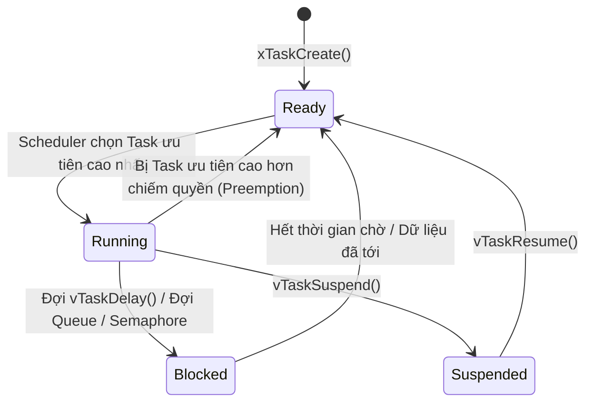

# Bài 01: FreeRTOS Toàn Tập: Quản Lý Task, Ngắt PendSV & Chuyển Đổi Ngữ Cảnh

> **Chuyên mục**: Level 2B - Hệ Điều Hành Thời Gian Thực  
> **Thời lượng ước tính**: 80 phút  
> **Tài liệu tham chiếu**: [`tech.md`](../tech.md) & [`process.md`](../process.md)

---

## 1. MỤC TIÊU BÀI HỌC (LEARNING OBJECTIVES)
- [ ] Phân biệt rõ sự khác nhau giữa kiến trúc vòng lặp vô tận (Bare-metal Super-loop) và Hệ điều hành thời gian thực (RTOS).
- [ ] Nắm vững 4 trạng thái của một Task trong FreeRTOS: **Running**, **Ready**, **Blocked**, và **Suspended**.
- [ ] Hiểu cặn kẽ bản chất cơ chế **Chuyển đổi ngữ cảnh (Context Switching)** được thực thi thông qua ngắt `PendSV` và đồng hồ `SysTick`.
- [ ] Sử dụng thành thạo Hàng đợi bản tin (Queues) và Cờ báo hiệu (Binary/Counting Semaphore).

---

## 2. BẢN CHẤT LÝ THUYẾT: TẠI SAO CẦN RTOS TRONG ROBOTICS?

Trong một robot tự hành phức tạp, hệ thống phải thực hiện đồng thời nhiều tác vụ:
1. Đọc cảm biến Encoder và chạy thuật toán PID vận tốc bánh xe ở chu kỳ chuẩn $100 \\text{ Hz}$ (Cần thời gian phản hồi tức thì và chính xác tuyệt đối).
2. Đọc cảm biến khoảng cách Lidar hoặc cảm biến siêu âm tránh vật cản.
3. Nhận lệnh điều khiển qua mạng không dây Wi-Fi / CAN Bus.
4. Hiển thị thông số pin và trạng thái lên màn hình OLED.

Nếu dùng kiến trúc vòng lặp `while(1)` truyền thống (Bare-metal), khi hàm vẽ màn hình OLED mất $50 \\text{ ms}$, vòng lặp PID động cơ sẽ bị gián đoạn, khiến bánh xe robot bị giật hoặc mất kiểm soát tốc độ.

**FreeRTOS giải quyết triệt để vấn đề này bằng Lập lịch chiếm quyền theo mức ưu tiên (Preemptive Priority-based Scheduling)**:
- Tác vụ PID động cơ được gán mức ưu tiên cao nhất (`Priority = 3`).
- Tác vụ màn hình OLED gán mức ưu tiên thấp nhất (`Priority = 1`).
- Khi đến thời điểm $10 \\text{ ms}$, ngắt SysTick đánh thức Task PID, CPU lập tức **tạm dừng (preempt)** Task OLED để tính toán xong tốc độ động cơ rồi mới quay lại vẽ tiếp!

---

## 3. VÒNG ĐỜI TASK (TASK LIFECYCLE)



---

## 4. BẢN CHẤT CƠ CHẾ CHUYỂN ĐỔI NGỮ CẢNH (CONTEXT SWITCHING)

Khi chuyển từ `Task 1` sang `Task 2`:
1. Ngắt **SysTick** xác định đã hết thời gian (Time Slice) của Task 1.
2. SysTick kích hoạt cờ ngắt **PendSV (Pended Service Call)**.
3. Khi tất cả các ngắt khẩn cấp khác đã thực thi xong, hàm `PendSV_Handler` bắt đầu chạy:
   - Lưu 8 thanh ghi phần mềm còn lại (R4 - R11) vào Stack của Task 1.
   - Cập nhật con trỏ Stack đỉnh của Task 1 vào khối điều khiển `pxCurrentTCB`.
   - Chuyển `pxCurrentTCB` trỏ sang Task 2.
   - Khôi phục (Pop) các thanh ghi R4 - R11 từ Stack của Task 2 vào CPU.
   - Thoát ngắt: CPU tự động khôi phục tiếp R0-R3, R12, LR, PC và bắt đầu chạy tiếp dòng lệnh dở dang của Task 2!

---

## 5. MÃ NGUỒN C MẪU KHỞI TẠO 2 TASK VÀ QUEUE TRONG FREERTOS

```c
#include "FreeRTOS.h"
#include "task.h"
#include "queue.h"

QueueHandle_t xSensorQueue;

/* Task 1: Đọc cảm biến nhiệt độ chu kỳ 100ms */
void vSensorTask(void *pvParameters) {
    float temp_val = 25.0f;
    for (;;) {
        temp_val += 0.1f;
        // Gửi dữ liệu vào Queue, đợi tối đa 10 ticks nếu Queue đầy
        xQueueSend(xSensorQueue, &temp_val, pdMS_TO_TICKS(10));
        
        // Đưa Task vào trạng thái Blocked chính xác 100ms (Không tốn CPU)
        vTaskDelay(pdMS_TO_TICKS(100));
    }
}

/* Task 2: Nhận dữ liệu và điều khiển quạt làm mát */
void vActuatorTask(void *pvParameters) {
    float received_temp;
    for (;;) {
        // Đợi dữ liệu từ Queue vô thời hạn (Blocked cho đến khi có dữ liệu)
        if (xQueueReceive(xSensorQueue, &received_temp, portMAX_DELAY) == pdPASS) {
            if (received_temp > 30.0f) {
                // Bật quạt tản nhiệt
            }
        }
    }
}

int main(void) {
    // Khởi tạo hàng đợi chứa tối đa 5 phần tử kiểu float
    xSensorQueue = xQueueCreate(5, sizeof(float));

    // Tạo Task đọc cảm biến (Ưu tiên 2)
    xTaskCreate(vSensorTask, "Sensor", 128, NULL, 2, NULL);

    // Tạo Task điều khiển cơ cấu chấp hành (Ưu tiên 1)
    xTaskCreate(vActuatorTask, "Actuator", 128, NULL, 1, NULL);

    // Bắt đầu khởi chạy bộ lập lịch RTOS
    vTaskStartScheduler();

    // Dòng này không bao giờ được chạm tới nếu hệ thống bình thường
    for (;;);
}
```

---

## 6. BÀI TẬP TRẮC NGHIỆM CỦNG CỐ KIẾN THỨC (QUIZ)

#### Câu hỏi 1: Lệnh `vTaskDelay(pdMS_TO_TICKS(100))` khác biệt gì về bản chất so với một hàm trễ bận (busy-wait delay) như `for(int i=0; i<100000; i++)`?
- [ ] A. Không có gì khác nhau, cả 2 đều làm vi điều khiển dừng chạy
- [ ] B. `vTaskDelay()` đưa Task hiện tại vào trạng thái **Blocked (Bị chặn)**, nhường toàn bộ 100% tài nguyên CPU cho các Task khác hoặc đưa CPU về chế độ ngủ tiết kiệm điện; trong khi vòng lặp bận chiếm dụng 100% CPU vô ích
- [ ] C. `vTaskDelay()` chỉ dùng được trên máy tính tính toán lượng tử
- [ ] D. `vTaskDelay()` làm xóa sạch RAM

<details>
<summary><b>👉 Xem Đáp Án & Giải Thích Chi Tiết</b></summary>

**Đáp án đúng: B**

**Giải thích chuyên sâu:**  
Đây là triết lý trung tâm của RTOS. Vòng lặp `for` ngốn toàn bộ chu kỳ xung nhịp và ngăn cản các tác vụ có mức ưu tiên thấp hơn được thực thi. Ngược lại, `vTaskDelay` báo cho Kernel biết Task này không có việc gì làm trong 100ms tới, Kernel sẽ gỡ Task ra khỏi danh sách Ready và nhường quyền chạy cho Task khác.
</details>

---

> 💡 *Sau khi hoàn thành bài học này, đừng quên cập nhật tiến độ vào [`process.md`](../process.md) trước khi commit!*
