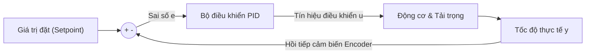

# Bài 01: Bộ Điều Khiển Hồi Tiếp Vòng Kín PID & Kỹ Thuật Chống Bão Hòa Tích Phân Anti-Windup

> **Chuyên mục**: Level 4 - Nền Tảng Kỹ Thuật Robotics  
> **Thời lượng ước tính**: 75 phút  
> **Tài liệu tham chiếu**: [`tech.md`](../tech.md) & [`process.md`](../process.md)

---

## 1. MỤC TIÊU BÀI HỌC (LEARNING OBJECTIVES)
- [ ] Hiểu bản chất vật lý và toán học của 3 thành phần: **Tỉ lệ (P)**, **Tích phân (I)** và **Vi phân (D)**.
- [ ] Rời rạc hóa phương trình vi phân liên tục sang dạng số (Discrete PID) để lập trình trên vi điều khiển nhúng.
- [ ] Nhận diện và triệt tiêu hoàn toàn hiện tượng **Integrator Windup (Bão hòa tích phân)** khi cơ cấu chấp hành (động cơ/mạch cầu H) chạm ngưỡng giới hạn công suất.

---

## 2. NGUYÊN LÝ BỘ ĐIỀU KHIỂN PID VÒNG KÍN

Trong một hệ thống robot, ta muốn điều khiển động cơ quay chính xác ở một vận tốc mong muốn (Setpoint: $r(t)$), bất chấp tải trọng thay đổi (ma sát mặt sàn dốc, khối lượng hàng thay đổi).



### Phương trình toán học liên tục:

$$u(t) = K_p \\cdot e(t) + K_i \\int_0^t e(\\tau) d\\tau + K_d \\cdot \\frac{de(t)}{dt}$$

Trong đó:
- Sai số: $e(t) = Setpoint - Measured$.
- **Khâu Tỉ Lệ (P)**: Phản ứng tỉ lệ thuận với sai số hiện tại. $K_p$ càng lớn, hệ thống càng phản hồi nhanh, nhưng nếu quá lớn sẽ gây dao động mạnh và mất ổn định. Khâu P thuần túy luôn để lại một **sai số xác lập (Steady-state error)**.
- **Khâu Tích Phân (I)**: Tích lũy toàn bộ sai số trong quá khứ theo thời gian. Khâu I có nhiệm vụ tối thượng là **triệt tiêu hoàn toàn sai số xác lập về 0**.
- **Khâu Vi Phân (D)**: Dự đoán xu hướng thay đổi của sai số trong tương lai dựa trên tốc độ biến thiên ($de/dt$). Khâu D đóng vai trò như một "chiếc phanh hãm", giảm độ vọt lố (Overshoot) và làm mượt dao động.

---

## 3. RỜI RẠC HÓA TRÊN HỆ THỐNG NHÚNG (DISCRETE PID)

Trên vi điều khiển, thuật toán PID được thực thi trong một hàm ngắt Timer có chu kỳ cố định $T_s = \\Delta t$ (ví dụ: $10 \\text{ ms} = 0.01 \\text{ s}$):

- Khâu Tỉ lệ: $P[k] = K_p \\cdot e[k]$
- Khâu Tích phân: $I[k] = I[k-1] + K_i \\cdot e[k] \\cdot \\Delta t$
- Khâu Vi phân: $D[k] = K_d \\cdot \\frac{e[k] - e[k-1]}{\\Delta t}$

Tín hiệu điều khiển tổng:

$$u[k] = P[k] + I[k] + D[k]$$

---

## 4. HIỆN TƯỢNG INTEGRATOR WINDUP & GIẢI PHÁP CLAMPING

### Hiện tượng:
Khi động cơ gặp tải nặng hoặc bị kẹt bánh, sai số $e[k]$ vẫn rất lớn. Khâu $I$ liên tục cộng dồn giá trị qua mỗi chu kỳ ngắt và vọt lên con số khổng lồ (ví dụ $100000$), trong khi mạch cầu H điều khiển PWM chỉ nhận giá trị tối đa là $100\\%$ ($ARR = 1000$). Khi vật cản biến mất, khâu $I$ phải mất hàng chục giây mới xả hết lượng sai số khổng lồ này, khiến động cơ tiếp tục quay hết tốc lực không kiểm soát!

### Giải pháp Clamping Anti-Windup:
Chỉ cho phép khâu tích phân tích lũy thêm nếu ngõ ra chưa chạm ngưỡng bão hòa:

```c
// Giới hạn giá trị của khâu I trong khoảng cho phép
if (pid->integral > pid->i_max) {
    pid->integral = pid->i_max;
} else if (pid->integral < pid->i_min) {
    pid->integral = pid->i_min;
}
```

---

## 5. MÃ NGUỒN C CHUẨN KỸ THUẬT ĐIỀU KHIỂN TỐC ĐỘ ĐỘNG CƠ

```c
#include <stdint.h>

typedef struct {
    float Kp;
    float Ki;
    float Kd;
    float integral;
    float prev_error;
    float out_min;
    float out_max;
    float i_limit;
} PID_Controller_t;

void PID_Init(PID_Controller_t *pid, float kp, float ki, float kd, float min, float max) {
    pid->Kp = kp;
    pid->Ki = ki;
    pid->Kd = kd;
    pid->integral = 0.0f;
    pid->prev_error = 0.0f;
    pid->out_min = min;
    pid->out_max = max;
    pid->i_limit = (max - min) * 0.5f; // Giới hạn tích phân ở mức 50% dải ra
}

float PID_Update(PID_Controller_t *pid, float setpoint, float measured, float dt) {
    float error = setpoint - measured;

    // 1. Tính toán khâu P
    float p_term = pid->Kp * error;

    // 2. Tính toán khâu I có chống bão hòa Clamping
    pid->integral += error * dt;
    if (pid->integral > pid->i_limit) pid->integral = pid->i_limit;
    if (pid->integral < -pid->i_limit) pid->integral = -pid->i_limit;
    float i_term = pid->Ki * pid->integral;

    // 3. Tính toán khâu D
    float d_term = 0.0f;
    if (dt > 0.0f) {
        d_term = pid->Kd * ((error - pid->prev_error) / dt);
    }

    // 4. Tổng ngõ ra
    float output = p_term + i_term + d_term;

    // 5. Bão hòa phần cứng (Saturation)
    if (output > pid->out_max) output = pid->out_max;
    if (output < pid->out_min) output = pid->out_min;

    pid->prev_error = error;
    return output;
}
```

---

## 6. BÀI TẬP TRẮC NGHIỆM CỦNG CỐ KIẾN THỨC (QUIZ)

#### Câu hỏi 1: Nếu một hệ thống điều khiển vị trí robot bị dao động liên tục quanh điểm đặt (Setpoint) và xuất hiện độ vọt lố (Overshoot) quá lớn, kỹ sư điều khiển nên can thiệp thế nào vào các hệ số PID?
- [ ] A. Tăng hệ số Ki lên 10 lần
- [ ] B. Giảm bớt hệ số Kp hoặc tăng thêm hệ số Kd để tạo lực cản dập tắt dao động
- [ ] C. Giảm hệ số Kd về 0
- [ ] D. Đảo ngược cực tính của động cơ

<details>
<summary><b>👉 Xem Đáp Án & Giải Thích Chi Tiết</b></summary>

**Đáp án đúng: B**

**Giải thích chuyên sâu:**  
Độ vọt lố và dao động mạnh là biểu hiện của khâu tỉ lệ Kp quá cao (hoặc khâu vi phân Kd quá nhỏ không đủ tạo ra lực hãm). Bằng cách giảm Kp hoặc tăng hệ số vi phân Kd (đo tốc độ biến thiên sai số), hệ thống sẽ chủ động hãm tốc khi tiến gần đến điểm đặt, giúp chuyển động mượt mà và triệt tiêu dao động.
</details>

---

> 💡 *Sau khi hoàn thành bài học này, đừng quên cập nhật tiến độ vào [`process.md`](../process.md) trước khi commit!*
