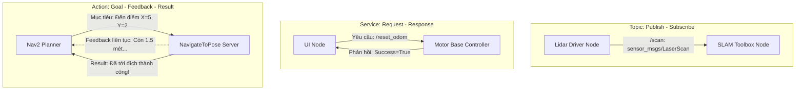

# Bài 01: Kiến Trúc ROS2 & Cầu Nối Phần Cứng Micro-ROS Với Vi Điều Khiển

> **Chuyên mục**: Level 5 - Robot Thông Minh & ROS2  
> **Thời lượng ước tính**: 85 phút  
> **Tài liệu tham chiếu**: [`tech.md`](../tech.md) & [`process.md`](../process.md)

---

## 1. MỤC TIÊU BÀI HỌC (LEARNING OBJECTIVES)
- [ ] Hiểu sâu kiến trúc phân tán DDS (Data Distribution Service) của ROS2 và lý do ROS2 loại bỏ hoàn toàn `roscore` (Single Point of Failure của ROS1).
- [ ] Phân biệt rõ ràng 4 mô hình truyền thông cốt lõi: **Topics**, **Services**, **Actions**, và **Parameters**.
- [ ] Nắm vững cách thức tích hợp vi điều khiển (STM32 / ESP32) trực tiếp vào mạng lưới ROS2 bằng giải pháp **Micro-ROS**.

---

## 2. TẠI SAO PHẢI LÀ ROS2 TRONG ROBOTICS HIỆN ĐẠI?

Robot Operating System (ROS) không phải là một hệ điều hành theo nghĩa truyền thống (như Linux hay Windows), mà là một bộ khung phần mềm trung gian (Middleware Framework) cung cấp:
- Hệ thống truyền thông giữa các tiến trình (Inter-Process Communication - IPC).
- Thư viện chuyển đổi hệ tọa độ thời gian thực (TF2).
- Bộ công cụ mô phỏng vật lý 3D (Gazebo).
- Ngăn xếp điều hướng tự hành cấp cao (Nav2).

### So sánh ROS1 vs ROS2:
| Tiêu Chí | ROS 1 | ROS 2 (Humble / Jazzy) |
| :--- | :--- | :--- |
| **Kiến trúc trung tâm** | Bắt buộc phải có `roscore` (Nếu master sập, cả robot tê liệt) | Phân tán hoàn toàn (DDS - Discovery động không cần master) |
| **Tính thời gian thực** | Không hỗ trợ Real-time | Hỗ trợ Real-time (Zero-copy IPC, POSIX real-time priority) |
| **Hỗ trợ Vi điều khiển** | Dùng `rosserial` rất yếu và dễ đứt kết nối | **Micro-ROS** (chạy DDS-XRCE chuẩn công nghiệp trên MCU) |
| **Bảo mật mạng** | Hoàn toàn không có mã hóa (Plain text) | Chuẩn bảo mật SROS2 (TLS, DTLS, xác thực chứng chỉ) |

---

## 3. BỐN MÔ HÌNH TRUYỀN THÔNG CỐT LÕI TRONG ROS2



---

## 4. MICRO-ROS: ĐƯA ROS2 TRỰC TIẾP LÊN STM32 / ESP32

Thông qua giao thức siêu nhẹ **DDS-XRCE (eXtremely Resource Constrained Environments)**, vi điều khiển có thể tạo trực tiếp một Node trong mạng ROS2 mà không cần cài Linux:

```
┌──────────────────────────────────────────────┐
│  MÁY TÍNH NHÚNG (Raspberry Pi 4 / Jetson)    │
│  Ubuntu 22.04 + ROS2 Humble                  │
│  Chạy lệnh:                                  │
│  $ ros2 run micro_ros_agent micro_ros_agent  │
│    serial --dev /dev/ttyUSB0 -b 115200       │
└──────────────────────┬───────────────────────┘
                       │ UART Serial (TX/RX)
┌──────────────────────▼───────────────────────┐
│  STM32F401RE / ESP32 (Micro-ROS Client)      │
│  - Tạo Node: "stm32_base_controller"         │
│  - Subscribe: "/cmd_vel" (geometry_msgs)     │
│  - Publish: "/odom" (nav_msgs/Odometry)      │
└──────────────────────────────────────────────┘
```

### Mã nguồn C mẫu khởi tạo Micro-ROS trên STM32:

```c
#include <rcl/rcl.h>
#include <rclc/rclc.h>
#include <geometry_msgs/msg/twist.h>

rcl_node_t node;
rclc_support_t support;
rcl_allocator_t allocator;
rcl_subscription_t subscriber;
geometry_msgs__msg__Twist msg_cmd_vel;

/* Callback xử lý khi máy tính ROS2 gửi lệnh vận tốc bánh xe */
void subscription_callback(const void * msin) {
    const geometry_msgs__msg__Twist * msg = (const geometry_msgs__msg__Twist *)msin;
    float linear_x = msg->linear.x;   // Vận tốc tiến/lùi (m/s)
    float angular_z = msg->angular.z; // Vận tốc quay góc (rad/s)
    
    // Đưa vận tốc này vào bộ điều khiển PID bánh trái & bánh phải!
    Motor_Set_Velocity(linear_x, angular_z);
}

void Start_MicroROS(void) {
    allocator = rcl_get_default_allocator();
    rclc_support_init(&support, 0, NULL, &allocator);

    // 1. Tạo node con trên vi điều khiển
    rclc_node_init_default(&node, "stm32_base_controller", "", &support);

    // 2. Đăng ký nhận bản tin vận tốc /cmd_vel
    rclc_subscription_init_default(
        &subscriber,
        &node,
        ROSIDL_GET_MSG_TYPE_SUPPORT(geometry_msgs, msg, Twist),
        "/cmd_vel"
    );
}
```

---

## 5. BÀI TẬP TRẮC NGHIỆM CỦNG CỐ KIẾN THỨC (QUIZ)

#### Câu hỏi 1: Trong hệ sinh thái ROS2, tại sao dòng dữ liệu quét từ cảm biến Lidar (LaserScan) luôn được gửi qua giao thức **Topic (Publish/Subscribe)** thay vì **Service**?
- [ ] A. Vì Service không thể chứa dữ liệu dạng số
- [ ] B. Vì Topic hoạt động theo cơ chế bất đồng bộ một chiều (Asynchronous data stream), một Node Lidar có thể phát liên tục ở tần số 10Hz - 20Hz cho nhiều Node cùng lúc (SLAM, Tránh vật cản, RViz trực quan hóa) mà không cần đợi phản hồi bắt tay làm chậm luồng
- [ ] C. Vì Lidar không có địa chỉ IP
- [ ] D. Vì Topic tốn ít dung lượng pin hơn

<details>
<summary><b>👉 Xem Đáp Án & Giải Thích Chi Tiết</b></summary>

**Đáp án đúng: B**

**Giải thích chuyên sâu:**  
Dữ liệu cảm biến là dòng chảy liên tục (continuous streaming data). Cơ chế Topic Publish/Subscribe cho phép bộ phát (Publisher) cứ việc đẩy dữ liệu lên mà không quan tâm ai đang nghe, và nhiều Node khác nhau có thể đồng thời đăng ký nghe (One-to-Many). Nếu dùng Service, Lidar sẽ phải đợi từng Node phản hồi mới được quét tia tiếp theo, gây tắc nghẽn toàn bộ hệ thống.
</details>

---

> 💡 *Sau khi hoàn thành bài học này, đừng quên cập nhật tiến độ vào [`process.md`](../process.md) trước khi commit!*
