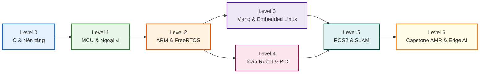

# 🚀 Embedded Systems & Robotics Comprehensive Self-Study Hub

<p align="center">
  
  
  
  
</p>

<p align="center">
  <b>Chương trình Tự học Mở Toàn diện từ Số 0 đến Kỹ sư Thực chiến Chuyên ngành Hệ thống Nhúng & Robotics</b><br/>
  <i>Deep-dive Hardware Architecture • Bare-metal C/C++ • FreeRTOS • Control Theory • ROS2 & SLAM • Quizzes & Hands-on Labs</i>
</p>

---

## 📌 QUY TẮC BẮT BUỘC ĐỌC TRƯỚC (START HERE)

Dự án được xây dựng và quản trị theo 2 tài liệu cốt lõi:

| Tài Liệu | Mô Tả & Nhiệm Vụ |
| :--- | :--- |
| 📖 **[`tech.md`](./tech.md)** | **Tài liệu Kỹ thuật Trung tâm & Toàn bộ Roadmap**: Bao gồm lộ trình 6 Cấp độ, chuẩn cấu trúc 7 phần của bài học, tiêu chuẩn hình ảnh/sơ đồ và bộ trắc nghiệm phản xạ kiến thức. |
| 📝 **[`process.md`](./process.md)** | **Nhật Ký Tiến Trình & Lịch Sử Commit**: Ghi lại chi tiết tiến độ học tập, bài học đã viết/học, lý do thay đổi và bug gặp phải **TRƯỚC VÀ SAU MỖI LẦN COMMIT**. |

---

## 🗺️ TỔNG QUAN LỘ TRÌNH 6 CẤP ĐỘ (ROADMAP OVERVIEW)



| Cấp độ | Tên Chuyên Đề | Trọng Tâm Kiến Thức | Tiến Độ | Thư Mục |
| :---: | :--- | :--- | :---: | :--- |
| **0** | **Nền Tảng Toán & CS Cơ Sở** | Bộ nhớ C (Stack/Heap/BSS), Con trỏ, Bitwise, Đại số tuyến tính, Mạch bán dẫn | 🔄 Planning | [`00-prerequisites/`](./00-prerequisites/) |
| **1** | **Vi Điều Khiển & Điện Tử Cơ Bản** | Bare-metal GPIO, Ngắt EXTI, Timer/PWM, ADC, Giao thức UART, SPI, I2C | ⏳ Queued | [`01-embedded-fundamentals/`](./01-embedded-fundamentals/) |
| **2** | **ARM Cortex-M & RTOS Chuyên Sâu** | Nhân ARM, NVIC, DMA, Linker Script, FreeRTOS đa nhiệm, Mutex, Semaphores | ⏳ Queued | [`02-mcu-architecture-arm/`](./02-mcu-architecture-arm/) & [`03-rtos-concurrency/`](./03-rtos-concurrency/) |
| **3** | **Hệ Thống Nhúng Nâng Cao & Mạng** | CAN Bus, RS-485 Modbus, Wi-Fi/BLE, Linux Nhúng căn bản | ⏳ Queued | [`03-rtos-concurrency/`](./03-rtos-concurrency/) |
| **4** | **Nền Tảng Robotics & Điều Khiển** | Encoder, IMU, Lọc Kalman (KF/EKF), Điều khiển PID, Động học vi sai & cánh tay | ⏳ Queued | [`04-robotics-foundations/`](./04-robotics-foundations/) |
| **5** | **Robot Thông Minh: ROS2 & SLAM** | ROS2 Humble, URDF, Mô phỏng Gazebo 3D, Lidar SLAM Toolbox, Nav2 | ⏳ Queued | [`05-ros2-and-simulation/`](./05-ros2-and-simulation/) |
| **6** | **Dự Án Capstone Thực Chiến** | Xe tự hành AMR hoàn chỉnh, Cánh tay 6-DOF, Edge AI/TinyML | ⏳ Queued | [`06-advanced-edge-ai/`](./06-advanced-edge-ai/) |

---

## 📂 CẤU TRÚC REPO CHUẨN MỰC

```
Embeded-system/
├── tech.md                          # Tài liệu Kỹ thuật Trung tâm & Quy chuẩn dự án
├── process.md                       # Sổ tay nhật ký tiến trình từng commit (BẮT BUỘC)
├── README.md                        # Trang chủ giới thiệu tổng quan dự án
├── templates/                       # Mẫu chuẩn hóa tạo nội dung
│   ├── lesson-template.md           # Template bài giảng lý thuyết (7 phần chuẩn mực)
│   ├── lab-template.md              # Template bài lab thực hành phần cứng/mô phỏng
│   └── quiz-template.md             # Template câu hỏi trắc nghiệm có giải thích sâu
├── 00-prerequisites/                # Level 0: C/C++, Toán vector, Điện tử cơ bản
├── 01-embedded-fundamentals/        # Level 1: Bare-metal MCU, GPIO, Timer, SPI/I2C/UART
├── 02-mcu-architecture-arm/         # Level 2A: ARM Cortex-M, NVIC, DMA, Bootloader
├── 03-rtos-concurrency/             # Level 2B & 3: FreeRTOS & Giao thức mạng
├── 04-robotics-foundations/         # Level 4: Toán động học robot, PID, Kalman Filter
├── 05-ros2-and-simulation/          # Level 5: ROS2, Gazebo, URDF, Lidar SLAM, Nav2
├── 06-advanced-edge-ai/             # Level 6: Capstone Project AMR & TinyML
└── assets/                          # Sơ đồ mạch, hình ảnh minh họa, waveform
```

---

## 🛠️ CÔNG CỤ & PHẦN CỨNG SỬ DỤNG

- **Mô phỏng 100% miễn phí**: [Wokwi Simulator](https://wokwi.com/) (STM32, ESP32), Renode, Gazebo 3D Simulator.
- **Phần cứng thực hành (Chi phí tối ưu)**:
  - Board STM32 BlackPill (F401/F411) hoặc Nucleo-F401RE + Mạch nạp ST-Link V2.
  - Kit ESP32 DevKit V1 (Wi-Fi/BLE).
  - USB Logic Analyzer 24M 8-kênh (Đo xung I2C, SPI, UART).
  - Cảm biến IMU MPU6050 & Động cơ DC Encoder.
- **Môi trường & Toolchain**: Ubuntu 22.04 LTS, ROS2 Humble, VS Code, `arm-none-eabi-gcc`, OpenOCD.

---

## 🤝 ĐÓNG GÓP & LIÊN HỆ

Dự án được xây dựng với tinh thần nguồn mở (Open Source) vì cộng đồng sinh viên và kỹ sư Việt Nam yêu thích phần cứng và robotics. Mọi đóng góp (Pull Request, bổ sung bài học, sửa lỗi, đề xuất Quiz mới) đều rất được hoan nghênh!

*⭐ Nếu bạn thấy lộ trình này hữu ích, hãy tặng repo một **Star** để lan tỏa đến cộng đồng nhé!*

