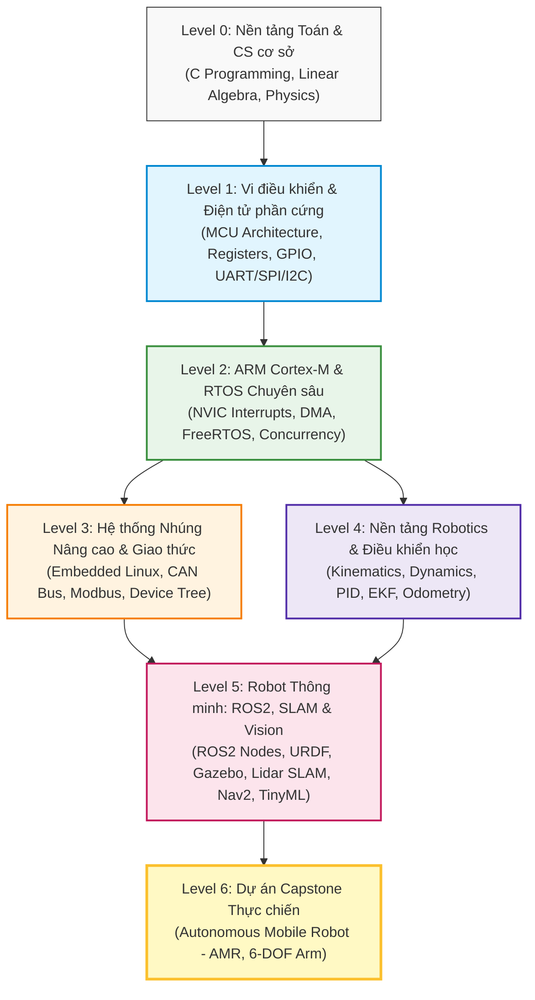
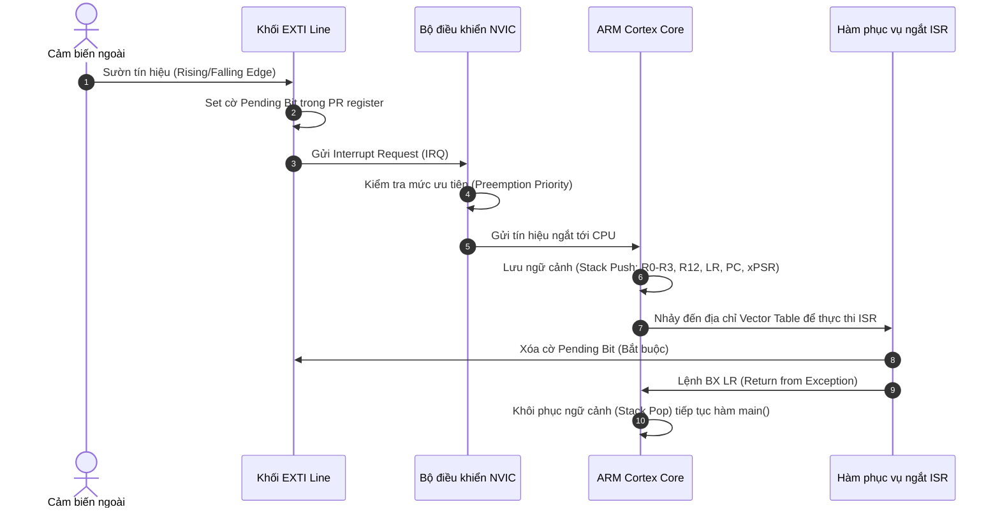

# ARCHITECTURE & ROADMAP SPECIFICATION: EMBEDDED SYSTEMS & ROBOTICS
> **Tài liệu Kỹ thuật Trung tâm & Khung Chương trình Tự học Toàn diện**  
> **Chuyên ngành**: Hệ thống Nhúng & Robotics (Embedded Systems & Robotics)  
> **Phiên bản**: 1.0.0 | **Tình trạng**: Đang phát triển (Active)

---

## ⚠️ QUY CHUẨN BẮT BUỘC: QUẢN LÝ TIẾN TRÌNH VỚI `process.md`

> [!IMPORTANT]
> **ĐỌC TRƯỚC KHI THỰC HIỆN BẤT KỲ CÔNG VIỆC NÀO:**  
> Mọi người học, cộng tác viên hoặc kỹ sư tham gia xây dựng dự án này **BẮT BUỘC** phải đọc và cập nhật file [`process.md`](./process.md) trước và sau mỗi lần thực hiện commit.
> 
> - **Mục đích của `process.md`**: Ghi nhận toàn bộ tiến trình làm việc thực tế, lịch sử thay đổi qua từng commit (Commit Log), lý do sửa đổi mã nguồn/bài học, các node kiến thức đã hoàn thành trong Roadmap, những lỗi (bugs) hay khó khăn gặp phải cùng hướng giải quyết.
> - **Quy tắc làm việc**:
>   1. Trước khi học hoặc code bài mới: Mở [`process.md`](./process.md) xem lại trạng thái của lần làm việc trước và mục tiêu tiếp theo.
>   2. Sau khi hoàn thành một bài học, lab hoặc sửa lỗi: Tạo một entry mới trong [`process.md`](./process.md) theo mẫu quy định trước khi thực hiện `git commit`.

---

## 1. TỔNG QUAN DỰ ÁN & TRIẾT LÝ TỰ HỌC (PHILOSOPHY)

### 1.1. Sứ mệnh dự án
Dự án được xây dựng nhằm cung cấp một **chương trình tự học mở (Open-source Self-Study Curriculum)** từ con số 0 (Beginner) đến trình độ kỹ sư chuyên nghiệp (Advanced / Industry-Ready) cho lĩnh vực giao thoa giữa **Hệ thống Nhúng (Embedded Systems)** và **Robotics**.

Nội dung được chắt lọc và tham chiếu từ các nguồn đào tạo hàng đầu:
- **CMU Robotics Institute** (Carnegie Mellon University: *18-349 Introduction to Embedded Systems*, *16-280 Intelligent Robot Systems*).
- **MIT EECS & MechE** (*6.08 Interconnected Embedded Systems*, *2.12 Introduction to Robotics*).
- **OSSU (Open Source Society University)** & **roadmap.sh**.
- Cộng đồng **Awesome-Embedded** và chuẩn công nghiệp thực tế (AUTOSAR, ROS2 Humble/Jazzy, FreeRTOS, ARM Cortex-M).

### 1.2. Triết lý 4 Trụ Cột (The 4 Pillars of Learning)
```
          ┌─────────────────────────────────────────────────────────┐
          │             KỸ SƯ EMBEDDED & ROBOTICS THỰC CHIẾN        │
          └────────────────────────────┬────────────────────────────┘
                                       │
     ┌───────────────────┬─────────────┴───────┬───────────────────┐
     │                   │                     │                   │
┌────▼─────────────┐┌────▼──────────────┐┌─────▼─────────────┐┌────▼─────────────┐
│ 1. BẢN CHẤT PHẦN ││ 2. CODE CHẮC TAY  ││ 3. ĐIỀU KHIỂN &   ││ 4. KIỂM THỬ VÀ   │
│    CỨNG VẬT LÝ   ││    (C / C++ / ASM)││    TOÁN ROBOTICS  ││    MÔ PHỎNG      │
│ Hiểu thanh ghi,  ││ C99/C11 bare-metal││ Động học, Động lực││ Wokwi, Renode,   │
│ clock, timing,   ││ OOP C++20, ROS2,  ││ học, Kalman, PID, ││ Gazebo, Oscill-  │
│ datasheet, mạch. ││ memory safety.    ││ SLAM, Path Plan.  ││ oscope & Logic.  │
└──────────────────┘└───────────────────┘└───────────────────┘└───────────────────┘
```

1. **Hiểu sâu tầng vật lý (Bottom-up)**: Không coi vi điều khiển là "hộp đen". Bắt đầu từ nguyên lý transistor, mạch số, cấu trúc thanh ghi (Registers), xung nhịp (Clock Tree), đến giản đồ thời gian (Timing Diagrams).
2. **Kỹ thuật phần mềm chuẩn chỉ (Robust Software Engineering)**: Lập trình C/C++ chuẩn công nghiệp, chú trọng quản lý bộ nhớ, ngắt (Interrupts), hệ điều hành thời gian thực (RTOS), và hạn chế tối đa hành vi không xác định (Undefined Behavior).
3. **Toán học & Giải thuật Robotics song hành**: Robotics không chỉ là nối dây động cơ; đó là sự kết hợp của Đại số tuyến tính, Giải tích vi phân, Động học ma trận (DH Parameter), Ước lượng trạng thái (Kalman Filter), và Quy hoạch quỹ đạo (Trajectory Planning).
4. **Củng cố qua Đồ họa & Trắc nghiệm phản xạ**: Mỗi bài giảng đều có hình ảnh sơ đồ hóa trực quan và bộ bài tập Quiz chẩn đoán lỗi chuyên sâu.

---

## 2. BỘ KHUNG LỘ TRÌNH TOÀN DIỆN (ROADMAP 6 LEVELS)



---

### LEVEL 0: NỀN TẢNG TOÁN HỌC, ĐIỆN TỬ VÀ KHOA HỌC MÁY TÍNH
*Thời lượng ước tính: 4-6 tuần | Thư mục: `00-prerequisites/`*

#### Mục tiêu:
Xây dựng nền tảng vững chắc về toán học vector cho robot, tư duy lập trình hệ thống cấp thấp bằng ngôn ngữ C, và các định luật điện tử cốt lõi.

#### Nội dung chi tiết:
1. **Lập trình C cho Hệ thống Nhúng (Embedded C Fundamentals)**:
   - Bộ nhớ trong C: Phân đoạn Stack, Heap, Data (Initialized `.data`), BSS (`.bss`), Text (`.text`).
   - Con trỏ chuyên sâu (Pointers): Con trỏ đơn, con trỏ hàm (Function Pointers - ứng dụng cho Callback và State Machine), con trỏ mảng, ép kiểu con trỏ bộ nhớ (Pointer Typecasting).
   - Từ khóa then chốt: `volatile` (ngăn tối ưu hóa compiler khi thao tác phần cứng/ISR), `const`, `static`, `register`.
   - Thao tác Bitwise thành thạo: Set bit, Clear bit, Toggle bit, Bitmasking, Read bit field.
   - Cấu trúc (Struct), Hợp nhất (Union) và Bit-fields trong ánh xạ thanh ghi (Memory-mapped Registers).
2. **C++ Hiện đại (Modern C++ for Robotics)**:
   - Cấu trúc C++ chuẩn (C++14/C++17/C++20), Quản lý tài nguyên thông minh RAII (`std::unique_ptr`, `std::shared_ptr`).
   - Lập trình hướng đối tượng trong Robotics: Đa hình (Polymorphism), Kế thừa (Inheritance), Templates.
3. **Toán học cho Robotics (Mathematics for Robotics)**:
   - **Đại số tuyến tính**: Không gian vector, Ma trận quay (Rotation Matrices 2D & 3D), Góc Euler (Roll-Pitch-Yaw), Quaternions (tránh hiện tượng Gimbal Lock).
   - **Giải tích & Tối ưu**: Vi phân, Đạo hàm ma trận (Jacobian), Chuỗi Taylor, Khái niệm Gradient Descent.
4. **Điện tử học cơ sở cho Kỹ sư Nhúng**:
   - Định luật Ohm, Kirchhoff (KCL, KVL), Cầu phân áp, Bộ lọc RC thông thấp (Low-pass filter khử nhiễu tín hiệu cảm biến).
   - Linh kiện bán dẫn: Điốt bảo vệ, Transistor BJT & MOSFET làm công tắc điều khiển tải/động cơ, Cầu H (H-Bridge).
   - Đọc và phân tích Schematic, sơ đồ chân (Pinout).

---

### LEVEL 1: NỀN TẢNG PHẦN CỨNG & LẬP TRÌNH VI ĐIỀU KHIỂN CƠ BẢN
*Thời lượng ước tính: 6-8 tuần | Thư mục: `01-embedded-fundamentals/`*

#### Mục tiêu:
Hiểu tận gốc cách vi điều khiển (MCU) hoạt động thông qua lập trình Bare-metal (thao tác trực tiếp thanh ghi), nắm vững các ngoại vi cơ bản và giao thức truyền thông tuần tự.

#### Nội dung chi tiết:
1. **Kiến trúc Vi điều khiển (Microcontroller Architecture)**:
   - Khác biệt giữa Von Neumann vs. Harvard Architecture.
   - Bản đồ bộ nhớ (Memory Map) và địa chỉ ngoại vi (Memory-Mapped I/O).
   - Chu kỳ xung nhịp (Clock Source: HSI, HSE, PLL) và Bộ tiền chia (Prescaler).
2. **Ngoại vi cốt lõi (Core Peripherals)**:
   - **GPIO**: Chế độ Push-Pull, Open-Drain, Pull-up/Pull-down, Tốc độ chuyển mạch (Slew Rate).
   - **External Interrupts (EXTI)**: Cơ chế ngắt ngoài, Bảng véc-tơ ngắt (Vector Table), Khử rung phím bấm (Debouncing phần cứng & phần mềm).
   - **Timers & PWM**: Bộ đếm (Up/Down/Center-aligned), Input Capture (đo chu kỳ xung/vận tốc encoder), Output Compare, Điều chế độ rộng xung (PWM) điều khiển độ sáng LED và tốc độ động cơ DC.
   - **ADC & DAC**: Bộ biến đổi tương tự - số, Độ phân giải (Resolution: 10-bit, 12-bit), Tần số lấy mẫu, Điện áp tham chiếu ($V_{ref}$), Lượng tử hóa tín hiệu cảm biến.
3. **Giao thức truyền thông nối tiếp (Serial Communication Protocols)**:
   - **UART / USART**: Nguyên lý truyền bất đồng bộ, Baudrate, Start/Stop/Parity bit, Ring Buffer xử lý dữ liệu ngắt nhận.
   - **SPI**: Nguyên lý đồng bộ 4 dây (MOSI, MISO, SCK, CS/SS), Cực tính và Pha xung nhịp (CPOL, CPHA - 4 SPI modes), Giao tiếp cảm biến gia tốc/Flash.
   - **I2C**: Nguyên lý 2 dây (SDA, SCL), Điện trở treo (Pull-up Resistors), Khung truyền địa chỉ 7-bit/10-bit, ACK/NACK, Giao tiếp cảm biến MPU6050 / Oled SSD1306.
4. **Công cụ chẩn đoán tín hiệu**:
   - Sử dụng Logic Analyzer (PulseView / Saleae) bắt dạng sóng I2C, SPI, UART để chẩn đoán lỗi phần cứng.

---

### LEVEL 2: VI ĐIỀU KHIỂN 32-BIT (ARM CORTEX-M) & HỆ ĐIỀU HÀNH THỜI GIAN THỰC (RTOS)
*Thời lượng ước tính: 6-8 tuần | Thư mục: `02-mcu-architecture-arm/` & `03-rtos-concurrency/`*

#### Mục tiêu:
Chuyển tiếp lên dòng vi điều khiển 32-bit tiêu chuẩn công nghiệp (ARM Cortex-M3/M4/M7, tiêu biểu là STM32) và làm chủ lập trình đa nhiệm thời gian thực với FreeRTOS.

#### Nội dung chi tiết:
1. **Kiến trúc ARM Cortex-M Core**:
   - Chế độ hoạt động: Thread Mode vs. Handler Mode, Quyền hạn: Privileged vs. Unprivileged.
   - Con trỏ ngăn xếp kép: Main Stack Pointer (MSP) và Process Stack Pointer (PSP).
   - Bộ quản lý ngắt lồng nhau (NVIC): Mức ưu tiên ngắt (Preemption Priority & Subpriority).
   - SysTick Timer: Xung nhịp hệ thống cơ sở.
   - Bộ điều khiển truy cập bộ nhớ trực tiếp (DMA): Chuyển dữ liệu ngoại vi - bộ nhớ không tốn chu kỳ CPU, Circular Mode, DMA Double Buffering.
2. **Khởi động vi điều khiển & Toolchain nội bộ**:
   - Quá trình Bootloader: Reset Handler, copy `.data` từ Flash sang RAM, zero-fill `.bss`, gọi hàm `main()`.
   - File Linker Script (`.ld`) và Startup Code (`.s`).
   - Debugging nâng cao: GDB, OpenOCD, SWD/JTAG, phân tích lỗi `HardFault` (sử dụng Call Stack & Fault Status Registers).
3. **Hệ điều hành thời gian thực (FreeRTOS)**:
   - Bản chất RTOS vs. Bare-metal Super-loop: Khi nào cần RTOS?
   - Quản lý Task: Vòng đời của Task (Running, Ready, Blocked, Suspended), Task Control Block (TCB), Ngăn xếp riêng của Task.
   - Cơ chế Chuyển đổi ngữ cảnh (Context Switching) qua ngắt `PendSV`.
   - Thuật toán định thời: Preemptive Priority-based Scheduling, Round-Robin.
   - Cơ chế đồng bộ & Truyền thông liên tiến trình (IPC):
     - **Queues**: Truyền bản tin an toàn giữa các task.
     - **Binary Semaphore & Counting Semaphore**: Đồng bộ ngắt (Deferred Interrupt Handling).
     - **Mutex & Recursive Mutex**: Bảo vệ tài nguyên chia sẻ, Vấn đề nghịch đảo ưu tiên (Priority Inversion) và Cơ chế thừa kế ưu tiên (Priority Inheritance).
     - **Event Groups & Direct to Task Notifications**: Tối ưu RAM và hiệu năng.
   - Quản lý bộ nhớ RTOS: So sánh `heap_1` đến `heap_5`, xử lý tràn ngăn xếp (Stack Overflow Hook).

---

### LEVEL 3: HỆ THỐNG NHÚNG NÂNG CAO, EMBEDDED LINUX & MẠNG CÔNG NGHIỆP
*Thời lượng ước tính: 6-8 tuần | Thư mục: `03-rtos-concurrency/` & `06-advanced-edge-ai/`*

#### Mục tiêu:
Nâng tầm hệ thống nhúng từ vi điều khiển sang bộ vi xử lý (MPU/SoC), làm quen với Linux nhúng (Embedded Linux) và các bus truyền thông đạt chuẩn ô tô/công nghiệp.

#### Nội dung chi tiết:
1. **Các chuẩn truyền thông Công nghiệp & Ô tô**:
   - **CAN Bus (Controller Area Network)**: Khung truyền tin CAN (Standard 11-bit vs. Extended 29-bit), Cơ chế phân xử tranh chấp không phá hủy (Bitwise Arbitration), CAN Transceiver, CANopen.
   - **RS-485 & Modbus RTU**: Giao tiếp khoảng cách xa chống nhiễu vi sai.
   - **Mạng không dây & IoT**: Wi-Fi, BLE (Bluetooth Low Energy), ESP-NOW, giao thức MQTT cho điều khiển từ xa.
2. **Embedded Linux cơ bản (Dành cho Raspberry Pi / Jetson / BeagleBone)**:
   - Các tầng trong kiến trúc Linux: Bootloader (U-Boot), Kernel, Device Tree (`.dts`/`.dtb`), Root Filesystem (RootFS).
   - Tương tác phần cứng trên Linux: `sysfs`, `libgpiod`, truy cập `spidev`, `i2c-dev`.
   - Lập trình mạng Socket C/C++ (TCP/IP, UDP) và Lập trình đa luồng POSIX (Pthreads).

---

### LEVEL 4: NỀN TẢNG KỸ THUẬT ROBOTICS & ĐIỀU KHIỂN TỰ ĐỘNG
*Thời lượng ước tính: 8-10 tuần | Thư mục: `04-robotics-foundations/`*

#### Mục tiêu:
Biến đổi các linh kiện phần cứng thành một cỗ máy thông minh; làm chủ toán học chuyển động của robot, ước lượng trạng thái cảm biến và giải thuật điều khiển hồi tiếp.

#### Nội dung chi tiết:
1. **Cảm biến & Xử lý tín hiệu trong Robotics**:
   - **Encoder**: Đọc xung vuông vi sai (Quadrature Encoder X2/X4), tính vận tốc góc và cự ly di chuyển.
   - **IMU (Inertial Measurement Unit)**: Con quay hồi chuyển (Gyroscope), Gia tốc kế (Accelerometer), Từ kế (Magnetometer).
   - Lọc tín hiệu: Bộ lọc bù (Complementary Filter), Bộ lọc Kalman tuyến tính (Kalman Filter - KF), Bộ lọc Kalman mở rộng (Extended Kalman Filter - EKF) để hợp nhất dữ liệu (Sensor Fusion) ước lượng góc nghiêng và tư thế (Orientation Estimation).
2. **Động cơ & Mạch truyền động**:
   - Động cơ DC có chổi than, Động cơ bước (Stepper Motor - Microstepping), Động cơ không chổi than (BLDC) & Điều khiển trường FOC (Field Oriented Control).
3. **Lý thuyết Điều khiển Tự động**:
   - Hệ thống vòng hở vs. Vòng kín (Closed-loop Feedback Control).
   - **Bộ điều khiển PID**: Khâu tỉ lệ (P), Khâu tích phân (I - khắc phục sai số xác lập và hiện tượng Anti-windup), Khâu vi phân (D - giảm độ vọt lố).
   - Kỹ thuật dò thông số PID (Tuning methods: Ziegler-Nichols, Trial and Error).
4. **Mô hình Động học Robot (Kinematics)**:
   - **Xe tự hành bánh vi sai (Differential Drive Mobile Robot)**: Vận tốc dài $v$, vận tốc góc $\omega$, tính toán Odometry từ encoder bánh xe.
   - **Cánh tay Robot (Serial Manipulators)**: Khung tọa độ tham chiếu, Quy tắc Denavit-Hartenberg (DH Parameters), Động học thuận (Forward Kinematics - FK), Động học nghịch (Inverse Kinematics - IK bằng phương pháp hình học và giải tích).
5. **Quy hoạch đường đi cơ bản (Path Planning)**:
   - Đồ thị không gian trạng thái: Thuật toán Dijkstra, $A^*$ (A-Star), RRT (Rapidly-exploring Random Tree).
   - Thuật toán bám quỹ đạo: Pure Pursuit, Stanley Controller.

---

### LEVEL 5: ROBOT THÔNG MINH VỚI ROS2, SLAM & THỊ GIÁC MÁY TÍNH
*Thời lượng ước tính: 10-12 tuần | Thư mục: `05-ros2-and-simulation/`*

#### Mục tiêu:
Ứng dụng tiêu chuẩn công nghiệp hiện đại nhất cho Robot: ROS2 (Robot Operating System 2), chạy mô phỏng trong Gazebo, thực hiện lập bản đồ tự hành (SLAM) và điều hướng tránh vật cản (Autonomous Navigation).

#### Nội dung chi tiết:
1. **Làm chủ ROS2 (Humble / Jazzy)**:
   - Kiến trúc ROS2: DDS (Data Distribution Service), Discovery protocol, So sánh ROS1 vs. ROS2.
   - Các khái niệm cốt lõi: Nodes, Topics (Publish/Subscribe), Services (Request/Response), Actions (Goal/Feedback/Result), Parameters, Launch Files.
   - Tạo Custom Messages & Services.
   - Giao tiếp giữa Vi điều khiển và ROS2: **Micro-ROS** (chạy ROS2 Node trực tiếp trên STM32/ESP32 qua UART/USB/Ethernet).
2. **Mô hình hóa và Mô phỏng Robot (Robot Modeling & Simulation)**:
   - Định dạng mô tả Robot: **URDF (Unified Robot Description Format)** và **Xacro**.
   - Thiết lập các khớp (Joints: Revolute, Continuous, Prismatic, Fixed) và các liên kết (Links: Visual, Collision, Inertial).
   - Trực quan hóa dữ liệu với **RViz2**.
   - Mô phỏng vật lý thực tế trong không gian 3D với **Gazebo (Ignition / Classic)**.
3. **Hệ tọa độ biến đổi TF2 (Transform Library)**:
   - Cây biến đổi tọa độ: `map` -> `odom` -> `base_link` -> `laser_frame` / `camera_link`.
   - Broadcast và Listen biến đổi TF2 thời gian thực.
4. **SLAM (Simultaneous Localization and Mapping)**:
   - Cảm biến khoảng cách: Lidar 2D (LaserScan), Depth Camera (PointCloud2).
   - Lập bản đồ lưới chiếm chỗ (Occupancy Grid Map): Thuật toán **Cartographer** và **SLAM Toolbox**.
5. **Điều hướng Tự động với Nav2 (ROS2 Navigation Stack)**:
   - Costmaps: Global Costmap vs. Local Costmap, Lớp vật cản (Obstacle Layer), Lớp thổi phồng (Inflation Layer).
   - Định vị toàn cục: AMCL (Adaptive Monte Carlo Localization).
   - Bộ quy hoạch đường đi toàn cục (Global Planner) và Bộ điều khiển cục bộ tránh vật cản động (DWB Controller / TEB Local Planner).
   - Hệ thống Cây hành vi (Behavior Trees) quản lý tác vụ robot.
6. **Thị giác Máy tính cho Robot (Computer Vision & TinyML)**:
   - Xử lý ảnh cơ bản với OpenCV C++/Python: Không gian màu, lọc biên cạnh, nhận diện đường line, bám vật thể theo màu sắc.
   - Nhận diện thẻ định vị ArUco Markers / AprilTags để định vị chính xác vị trí sạc pin hoặc đón hàng.
   - Giới thiệu Edge AI & TinyML: Chạy mô hình mạng nơ-ron rút gọn (TensorFlow Lite for Microcontrollers) trên MCU để nhận diện cử chỉ, âm thanh.

---

### LEVEL 6: DỰ ÁN CAPSTONE THỰC CHIẾN & CHUẨN CÔNG NGHIỆP
*Thời lượng ước tính: 4-6 tuần | Thư mục: `06-advanced-edge-ai/`*

#### Mục tiêu:
Tích hợp toàn bộ kiến thức từ Cấp độ 0 đến 5 vào 2 dự án kỹ thuật quy mô lớn chuẩn đồ án tốt nghiệp / sản phẩm công nghiệp:

1. **Dự án Capstone 1: Autonomous Mobile Robot (AMR) - Xe tự hành thông minh**:
   - **Tầng dưới (Low-level Hardware)**: STM32F4/ESP32 chạy FreeRTOS, đọc Encoder 2 bánh, chạy 2 vòng lặp PID tốc độ động cơ ở tần số 100Hz, đọc IMU và tính toán Odometry, giao tiếp Micro-ROS qua UART.
   - **Tầng trên (High-level Compute)**: Raspberry Pi 4 hoặc Jetson Nano chạy Ubuntu Server & ROS2, kết nối 2D Lidar + Camera, chạy SLAM Toolbox dựng bản đồ nhà/kho và Nav2 tự động di chuyển đến điểm chỉ định mà không va chạm.
2. **Dự án Capstone 2: Cánh tay Robot 4-DOF hoặc 6-DOF (Robotic Arm Manipulator)**:
   - Tính toán động học DH, mô hình hóa URDF, tích hợp MoveIt2 trong ROS2 để tính toán quỹ đạo tránh vật cản, gửi tập lệnh góc quay xuống vi điều khiển điều khiển động cơ servo/bước.
3. **Quy chuẩn Kỹ thuật Phần mềm (Software Best Practices)**:
   - Viết Unit Test cho firmware với framework Unity/CMock.
   - Thiết lập luồng CI/CD tự động build firmware bằng GitHub Actions.
   - Viết tài liệu kỹ thuật chuẩn Doxygen.

---

## 3. TIÊU CHUẨN SOẠN BÀI GIẢNG (PEDAGOGICAL STANDARD)

Mỗi file bài giảng trong dự án (ví dụ `01-gpio-registers.md`) **bắt buộc** phải tuân theo cấu trúc 7 phần chuẩn mực sau:

```markdown
# [Tên Bài Học]: [Tiêu Đề Phụ Giải Thích Bản Chất]

## 1. Mục Tiêu Bài Học (Learning Objectives)
- Nắm rõ bản chất vật lý của ...
- Phân tích được các bit trong thanh ghi ...
- Tự viết được driver điều khiển bằng C chuẩn không lỗi ...

## 2. Bản Chất Lý Thuyết & Nguyên Lý Hoạt Động (Core Theory)
(Giải thích cặn kẽ từ mức điện tử/phần cứng, không nói chung chung, sử dụng công thức nếu có)

## 3. Sơ Đồ Khối & Giản Đồ Tín Hiệu (Visual Diagrams)
(Tối thiểu 1 sơ đồ Mermaid hoặc sơ đồ ASCII biểu diễn cấu trúc phần cứng/thời gian)

## 4. Phân Tích Thanh Ghi & Sơ Đồ Bộ Nhớ (Register Deep Dive)
(Trích xuất bảng thanh ghi, giải thích từng bit-field quan trọng)

## 5. Mã Nguồn Mẫu Chuẩn Kỹ Thuật (Production Code Walkthrough)
(Code C/C++ có comment giải thích rõ ràng, xử lý lỗi, chuẩn bare-metal hoặc HAL/LL)

## 6. Bài Thực Hành (Hands-on Lab Exercise)
- **Mục tiêu**: ...
- **Dụng cụ / Simulator**: (Ví dụ Wokwi hoặc board thực tế)
- **Các bước tiến hành**: ...
- **Thử thách nâng cao**: ...

## 7. Bài Tập Trắc Nghiệm Củng Cố (Self-Check Quiz)
(Bắt buộc có từ 3 - 5 câu hỏi trắc nghiệm chất lượng cao, có giải thích đáp án)

## 8. Tài Liệu Tham Khảo (Further Reading)
- Link Datasheet / Reference Manual (trang cụ thể)
- Sách chuyên ngành hoặc bài báo học thuật liên quan
```

---

## 4. TIÊU CHUẨN ĐỒ HỌA & SƠ ĐỒ TRỰC QUAN (DIAGRAM STANDARDS)

Để người học dễ dàng tiếp thu kiến thức phần cứng trừu tượng, dự án quy định 3 hình thức trực quan hóa bắt buộc:

### 4.1. Sơ đồ khối Mermaid (Flowchart, Sequence, State Diagram)
Dùng để biểu diễn luồng dữ liệu, quá trình bắt tay ngắt (Interrupt handshake), hoặc máy trạng thái hữu hạn (FSM).

*Ví dụ: Luồng ngắt ngoài NVIC:*


### 4.2. Sơ đồ Thanh ghi & Phân bố Bit bằng ASCII (Register Bitfield Map)
Dùng để mô tả chính xác từng bit trong thanh ghi phần cứng nhằm phục vụ việc lập trình bare-metal:

```
Thanh ghi: GPIOx_MODER (GPIO Port Mode Register) - Địa chỉ cơ sở Offset: 0x00
Reset value: 0xA800 0000 (Port A), 0x0000 0000 (Port khác)

Bit 31 30  29 28      11 10   9  8    7  6    5  4    3  2    1  0
┌───────┬───────┬───┬───────┬───────┬───────┬───────┬───────┬───────┐
│MODER15│MODER14│...│MODER5 │MODER4 │MODER3 │MODER2 │MODER1 │MODER0 │
└───────┴───────┴───┴───────┴───────┴───────┴───────┴───────┴───────┘
  [1:0] : 00 = Input Mode (Chế độ đọc đầu vào)
          01 = General Purpose Output Mode (Xuất tín hiệu số)
          10 = Alternate Function Mode (Chức năng thay thế: UART/SPI/PWM)
          11 = Analog Mode (Tương tự - dùng cho ADC/DAC)
```

### 4.3. Giản đồ Thời gian Tín hiệu (Timing Waveforms)
Dùng để phân tích các giao thức truyền thông tuần tự (như SPI CPOL/CPHA hoặc I2C Start/Stop condition):

```
I2C START & STOP CONDITION TIMING:

SCL (Clock)  : ───┐     ┌───┐     ┌───┐            ┌───┐     ┌───────
                  │     │ 1 │     │ 2 │   ...      │ 8 │     │ 9(ACK)
                  └─────┘   └─────┘   └──        ──┘   └─────┘       

SDA (Data)   : ──┐                                         ┌─────────
                 │ (SDA tụt khi SCL HIGH)      (SDA tăng khi SCL HIGH)
                 └──────[ START CONDITION ]───────...───[ STOP CONDITION ]───
```

---

## 5. QUY CÁCH BỘ CÂU HỎI TRẮC NGHIỆM (QUIZ FRAMEWORK)

Mỗi bài học phải tích hợp bài kiểm tra đánh giá kiến thức gồm các dạng câu hỏi sau:

1. **Câu hỏi Khái niệm & Nguyên lý cốt lõi (Conceptual Questions)**: Đánh giá hiểu biết bản chất phần cứng, tránh học vẹt.
2. **Câu hỏi Đọc mã nguồn & Trace lỗi bộ nhớ (Code Analysis & Bug Spotting)**: Cho một đoạn mã C/C++ nhúng có lỗi tiềm ẩn (race condition, thiếu `volatile`, tràn stack, sai thứ tự xóa cờ ngắt) và yêu cầu người học phát hiện.
3. **Câu hỏi Giản đồ thời gian & Chẩn đoán phần cứng (Timing & Waveform Analysis)**: Cho dạng sóng bắt được từ Logic Analyzer, hỏi về baudrate, dữ liệu truyền đi, hoặc lỗi handshake (thiếu ACK, sai pha SPI).

### Cấu trúc chuẩn của một câu hỏi trắc nghiệm:
```markdown
#### Câu hỏi 1: Tại sao biến chia sẻ giữa ngắt (ISR) và hàm main() bắt buộc phải khai báo từ khóa `volatile`?

- [ ] A. Để đảm bảo biến được lưu trữ trong bộ nhớ Flash thay vì RAM.
- [ ] B. Để ngăn trình biên dịch (compiler) tối ưu hóa giá trị biến vào thanh ghi CPU, buộc CPU luôn đọc trực tiếp từ ô nhớ RAM.
- [ ] C. Để tăng tốc độ thực thi của hàm xử lý ngắt ISR.
- [ ] D. Để tự động khóa ngắt (disable interrupts) khi hàm main() truy cập biến.

<details>
<summary><b>👉 Xem Đáp Án & Giải Thích Chi Tiết</b></summary>

**Đáp án đúng: B**

**Giải thích chuyên sâu:**
- Trình biên dịch C (như GCC, Clang) khi bật cờ tối ưu (`-O2`, `-O3`) sẽ quan sát thấy trong vòng lặp `while(flag == 0)` của hàm `main()`, biến `flag` không bị thay đổi bởi bất kỳ câu lệnh nào trong hàm đó. Do đó, compiler sẽ nạp giá trị của `flag` vào một thanh ghi nội bộ của CPU (như `R0`) một lần duy nhất và kiểm tra liên tục trên thanh ghi đó để tiết kiệm thời gian truy xuất RAM.
- Khi có ngắt ngoại vi xảy ra, ISR thay đổi `flag = 1` trong RAM. Tuy nhiên, hàm `main()` vẫn tiếp tục đọc thanh ghi cũ và rơi vào vòng lặp vô tận (Deadlock/Hang).
- Từ khóa `volatile` là lời chỉ dẫn cho compiler: *"Giá trị của biến này có thể bị thay đổi bất ngờ bởi phần cứng bên ngoài hoặc tiến trình bất đồng bộ khác; mỗi khi đọc hoặc ghi biến này, hãy sinh mã máy nạp/ghi trực tiếp tới địa chỉ RAM!"*
</details>
```

---

## 6. DANH MỤC CÔNG CỤ & PHẦN CỨNG ĐỀ XUẤT (TOOLS & ENVIRONMENT)

### 6.1. Bộ công cụ phát triển phần mềm (Software Toolchain - 100% Free & Open Source)
- **Compiler**: `arm-none-eabi-gcc` (cho vi điều khiển ARM), `gcc/g++` (cho Linux & ROS2).
- **Build System**: CMake (chuẩn công nghiệp hiện đại), Ninja, Makefiles.
- **Debugger**: OpenOCD, GDB, ST-Link Tools.
- **IDE / Editor**: VS Code (tiện ích mở rộng: *C/C++*, *Cortex-Debug*, *CMake Tools*, *ROS*), STM32CubeIDE.
- **Môi trường Robotics**: Ubuntu 22.04 LTS (Jammy) chạy **ROS2 Humble Hawksbill** hoặc Ubuntu 24.04 LTS chạy **ROS2 Jazzy Jalisco**.

### 6.2. Môi trường Mô phỏng Phần mềm (Simulators - Học không cần phần cứng)
- **Wokwi**: Mô phỏng vi điều khiển ESP32, STM32, Arduino và các module cảm biến (MPU6050, OLED, LCD, Servo) chạy trực tiếp trên trình duyệt hoặc VS Code extension.
- **Renode / QEMU**: Mô phỏng vi điều khiển ARM Cortex-M ở cấp độ chu kỳ lệnh (Instruction-accurate simulation).
- **Gazebo & Webots**: Phần mềm mô phỏng không gian vật lý 3D cho robot, mô phỏng cảm biến Lidar, Camera, va chạm vật lý, trọng lực và động cơ.

### 6.3. Phần cứng thực tế khuyến nghị cho sinh viên (Tiết kiệm & Hiệu quả cao)
1. **Kit Vi điều khiển Cơ bản & Nâng cao**:
   - Board **STM32F401RE / STM32F411CE (BlackPill)** hoặc **Nucleo-F401RE** (Cortex-M4, có FPU, 84MHz - 100MHz).
   - Mạch nạp **ST-Link V2**.
   - Board **ESP32 DevKit V1** (Wi-Fi, Bluetooth, lõi kép 240MHz).
2. **Linh kiện đo kiểm & Ngoại vi**:
   - Thiết bị phân tích logic 8 kênh 24MHz (USB Logic Analyzer 24M 8CH - giá khoảng 100k - 150k VNĐ).
   - Cảm biến IMU 6-DOF (MPU6050 / ICM-20948).
   - Động cơ DC có gắn đĩa Encoder quang/từ (loại GA25 hoặc JGB37) + Mạch cầu H L298N hoặc TB6612FNG.
3. **Phần cứng Robotics cấp cao (Giai đoạn ROS2)**:
   - Máy tính nhúng (Single Board Computer - SBC): Raspberry Pi 4 Model B (4GB/8GB RAM) hoặc máy tính cá nhân cài Dual Boot Linux Ubuntu.
   - Cảm biến Lidar 2D giá rẻ (RPLidar A1M8 hoặc YDLidar X2/X4).

---

## 7. CẤU TRÚC THƯ MỤC DỰ ÁN (PROJECT DIRECTORY TREE)

```
Embeded-system/
├── tech.md                          # TÀI LIỆU NÀY: Kiến trúc, quy chuẩn & Roadmap
├── process.md                       # BẮT BUỘC: Lịch sử commit, tiến trình làm việc chi tiết
├── README.md                        # Giới thiệu dự án, hướng dẫn nhập môn nhanh
├── templates/                       # Mẫu chuẩn hóa tài liệu dự án
│   ├── lesson-template.md           # Template soạn bài học lý thuyết
│   ├── lab-template.md              # Template bài tập thực hành phần cứng/mô phỏng
│   └── quiz-template.md             # Template bộ câu hỏi trắc nghiệm & phân tích lỗi
├── 00-prerequisites/                # Level 0: C/C++, Toán vector, Vật lý điện tử
├── 01-embedded-fundamentals/        # Level 1: MCU Bare-metal, GPIO, Timer, UART/SPI/I2C
├── 02-mcu-architecture-arm/         # Level 2A: ARM Cortex-M, NVIC, DMA, Clock Tree, GDB
├── 03-rtos-concurrency/             # Level 2B & 3A: FreeRTOS, Quản lý đa nhiệm, IPC
├── 04-robotics-foundations/         # Level 4: Động học, Động lực học, Kalman, PID, Odometry
├── 05-ros2-and-simulation/          # Level 5: ROS2, Gazebo, URDF, Lidar SLAM, Nav2
├── 06-advanced-edge-ai/             # Level 6: Capstone AMR, Edge AI/TinyML, Embedded Linux
└── assets/                          # Kho tài nguyên dùng chung
    ├── diagrams/                    # Các sơ đồ kiến trúc, timing waveform, schematics
    └── images/                      # Hình ảnh thực tế linh kiện, bảng mạch
```

---

## 8. HƯỚNG DẪN BƯỚC ĐẦU BẮT TAY VÀO DỰ ÁN (GETTING STARTED)

1. **Bước 1**: Đọc kỹ toàn bộ lộ trình trong tài liệu [`tech.md`](./tech.md) này để định vị kiến thức hiện tại của bản thân.
2. **Bước 2**: Mở file [`process.md`](./process.md) để xem nhật ký làm việc và quy ước ghi chép commit.
3. **Bước 3**: Bắt đầu bài học đầu tiên tại thư mục `00-prerequisites/` hoặc chọn nhánh chuyên đề muốn trau dồi.
4. **Bước 4**: Tại mỗi bài học: Đọc lý thuyết -> Quan sát sơ đồ -> Tự gõ code -> Chạy mô phỏng / nạp board mạch -> Trả lời các câu hỏi Quiz để tự đánh giá.
5. **Bước 5**: Khi hoàn thành hoặc có cải tiến nội dung: Cập nhật nhật ký vào [`process.md`](./process.md) rồi thực hiện `git commit`.
