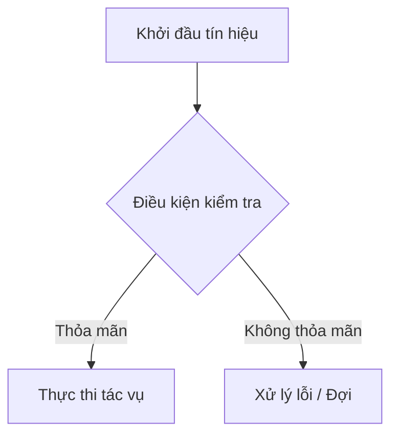

# [Tên Bài Học]: [Tiêu Đề Phụ Diễn Giải Bản Chất]

> **Chuyên mục**: [Cấp độ X - Tên Cấp Độ]  
> **Thời gian ước tính**: [X phút/giờ]  
> **Yêu cầu tiên quyết**: [Bài học trước đó hoặc kiến thức cần có]

---

## 1. MỤC TIÊU BÀI HỌC (LEARNING OBJECTIVES)
Sau khi hoàn thành bài học này, bạn sẽ có khả năng:
- [ ] Giải thích được nguyên lý vật lý và bản chất hoạt động của ...
- [ ] Phân tích được các bit chức năng trong thanh ghi cấu hình ...
- [ ] Tự tay lập trình cấu hình ngoại vi / giải thuật bằng C/C++ chuẩn.
- [ ] Nhận diện và xử lý được các lỗi phổ biến (Race condition, Timing violations, Memory leak).

---

## 2. BẢN CHẤT LÝ THUYẾT & NGUYÊN LÝ HOẠT ĐỘNG (CORE THEORY)

### 2.1. Đặt vấn đề trong thực tế
*(Tại sao chúng ta cần công nghệ/ngoại vi/giải thuật này? Nếu không có nó, hệ thống sẽ gặp bế tắc gì?)*

### 2.2. Nguyên lý cấu tạo & Cách thức hoạt động
*(Mô tả chi tiết nguyên lý từ mức vật lý/phần cứng, không đi tắt, kèm theo công thức toán học nếu có)*

---

## 3. SƠ ĐỒ TRỰC QUAN (VISUAL DIAGRAMS)

*(Chèn ít nhất 1 sơ đồ khối Mermaid, giản đồ thời gian hoặc sơ đồ luồng hoạt động)*



---

## 4. PHÂN TÍCH THANH GHI & BẢN ĐỒ BỘ NHỚ (REGISTER DEEP DIVE)

*(Dành cho các bài vi điều khiển bare-metal / driver)*

```
Tên thanh ghi: PERIPH_REG_NAME (Mô tả ngắn gọn)
Địa chỉ Offset: 0xXX | Giá trị sau Reset: 0x00000000

Bit [31:16] : Reserved (Không sử dụng)
Bit [15:8]  : CONFIG_PARAM (Cấu hình tham số A/B/C)
Bit [7:0]   : DATA_BUFFER  (Dữ liệu truyền/nhận)
```

---

## 5. MÃ NGUỒN MẪU CHUẨN KỸ THUẬT (PRODUCTION CODE)

```c
/**
 * @file    main.c
 * @brief   Chương trình mẫu điều khiển ...
 * @note    Tuân thủ quy chuẩn mã nguồn MISRA C / An toàn bộ nhớ
 */

#include <stdint.h>

void System_Init(void) {
    // Khởi tạo ngoại vi
}

int main(void) {
    System_Init();
    while (1) {
        // Vòng lặp chính
    }
}
```

---

## 6. BÀI THỰC HÀNH (HANDS-ON LAB)
- **Công cụ yêu cầu**: [Board thật hoặc link Wokwi mô phỏng]
- **Sơ đồ kết nối**: [Mô tả chân cắm GPIO, nguồn, GND]
- **Nhiệm vụ chính**: ...
- **Thử thách nâng cao (Challenge)**: ...

---

## 7. BÀI TẬP TRẮC NGHIỆM CỦNG CỐ (SELF-CHECK QUIZ)

*(Xem chi tiết cấu trúc tại `templates/quiz-template.md`)*

#### Câu 1: [Nội dung câu hỏi trắc nghiệm?]
- [ ] A. Đáp án A
- [ ] B. Đáp án B
- [ ] C. Đáp án C
- [ ] D. Đáp án D

<details>
<summary><b>👉 Xem Đáp Án & Giải Thích Chi Tiết</b></summary>

**Đáp án đúng: [X]**  
*Giải thích chi tiết tại sao đúng và tại sao các phương án khác sai...*
</details>

---

## 8. TÀI LIỆU THAM KHẢO & ĐỌC THÊM (FURTHER READING)
- [Datasheet / Reference Manual](link) - Trang XX-YY.
- [Sách tham khảo]: Tác giả, Nhà xuất bản.
